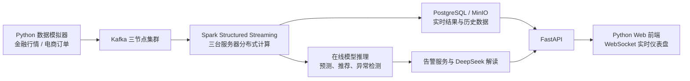

# 分布式实时金融与电商智能决策平台

## 快速启动（已实现的 MVP）

本仓库现已包含一个前后端分离的演示平台：Vue 3 网页、FastAPI REST API、SQLAlchemy 数据库、实时模拟流、机器学习推理，以及 DeepSeek 分析接口。

```powershell
Copy-Item .env.example .env
python -m pip install -r requirements.txt
python -m uvicorn app.main:app --reload --port 8080
```

另开一个终端启动 Vue 前端：

```powershell
cd frontend
npm install
npm run dev
```

浏览器访问 <http://127.0.0.1:5173>，接口文档访问 <http://127.0.0.1:8080/docs>。默认使用本地 SQLite；如需 DeepSeek，请在 `.env` 中填入 `DEEPSEEK_API_KEY`。

首次打开网页时创建账户即可登录。密码仅保存 PBKDF2-SHA256 加盐哈希；生产部署前必须通过 `AUTH_SECRET` 配置一个足够长的随机令牌签名密钥。

### Docker 单机演示

```powershell
docker compose up --build
```

默认会启动 Vue/Nginx、FastAPI 和 PostgreSQL，足以运行网页、登录注册、实时模拟和机器学习推理。启动完成后访问 <http://127.0.0.1:8080>；FastAPI 接口文档位于 <http://127.0.0.1:8000/docs>。容器内网页服务使用 PostgreSQL；本地不使用 Docker 时则自动回退到 SQLite。

如需同时启动 Redis、Kafka、Spark Master 和 Spark Worker，使用可选的分布式配置：

```powershell
docker compose --profile distributed up --build
```

此时 Spark 管理页面位于 <http://127.0.0.1:8081>。`streaming/spark_job.py` 是接入 Kafka 后可提交的 PySpark Structured Streaming 聚合任务。

后台运行和停止：

```powershell
docker compose up --build -d
docker compose down
```

真实数据准备、Olist 转换、Kafka 回放和 Spark 提交流程见 [data/README.md](data/README.md)。

### 三台服务器部署

`deploy/swarm-stack.yml` 提供 Docker Swarm 起点。应在三台服务器建立 Overlay 网络，并分别标记 `control`、`compute-a`、`compute-b` 节点；上线前务必替换镜像仓库地址和数据库密码。Kafka 三节点和 PostgreSQL 主从复制需要根据服务器 IP 与课程要求补充生产级配置。

### 当前演示功能

- 每秒回放金融行情和电商订单，并可从网页启动、暂停或单步推进；
- Isolation Forest 检测价格波动与异常订单；随机森林给出短期预测；K-Means 给出用户分层；模型页说明 ALS/LSTM 扩展位；
- 仪表盘持续刷新金融曲线、GMV、订单、告警、Kafka/Spark 指标与三节点状态；
- DeepSeek API 将聚合后的指标转为中文解释；未配密钥时使用清晰标识的本地演示解释器；
- API 包含 `/api/dashboard`、`/api/finance`、`/api/ecommerce`、`/api/models`、`/api/simulation/*` 和 `/api/ai/explain`。

## 1. 项目概述

本项目是一个使用 Python 构建的分布式大数据与机器学习 Web 应用。平台将真实金融数据、电商数据和评论/舆情数据接入统一的数据处理链路，支持离线分析与模拟实时数据流分析，并以网页仪表盘的形式实时展示预测、推荐、告警和集群运行状态。

项目重点体现以下能力：

- 三台服务器组成的分布式部署；
- Kafka 实时消息流与 Spark 流式计算；
- 机器学习预测、聚类、推荐和异常检测；
- Python 全栈网页前后端及数据库；
- DeepSeek API 驱动的智能问答与告警解读；
- Docker 容器化部署。

## 2. 业务目标

平台面向金融监测和电商运营两个场景：

1. 对股票等金融行情进行实时展示、短期预测和风险预警；
2. 对电商订单流进行实时统计、销量预测、用户分群、商品推荐和异常订单识别；
3. 对商品评论或财经新闻进行情感分析和热点统计；
4. 通过 DeepSeek 将模型结果转化为通俗的自然语言分析报告。

## 3. 真实数据集

| 数据类别 | 推荐来源 | 可实现功能 |
| --- | --- | --- |
| 金融数据 | Yahoo Finance（通过 `yfinance` 获取历史 OHLCV 行情） | 价格趋势、波动率、短期预测、异常波动检测 |
| 电商数据 | Olist Brazilian E-Commerce Dataset | 订单分析、用户画像、销量预测、推荐、异常订单检测 |
| 文本数据 | Amazon Reviews Dataset，或 Olist 商品评价与财经新闻标题 | 评论情感分析、关键词提取、舆情趋势 |

## 4. 分布式部署规划

| 服务器 | 核心组件 | 主要职责 |
| --- | --- | --- |
| 服务器 1：主控与展示节点 | Vue、FastAPI、Nginx、Kafka Broker、Spark Master、PostgreSQL 主库 | 提供网页与 API、接入数据流、调度 Spark 任务、保存业务元数据 |
| 服务器 2：计算节点 A | Spark Worker、Kafka Broker、MinIO/HDFS DataNode、PostgreSQL 从库 | 分布式流处理、历史数据存储、模型推理 |
| 服务器 3：计算节点 B | Spark Worker、Kafka Broker、MinIO/HDFS DataNode、Redis | 分布式流处理、缓存、告警、模型服务 |

建议使用 Kafka 三节点集群，以提高实时消息服务的可用性；Spark 使用一个 Master 和两个 Worker。PostgreSQL 可配置主从复制，Redis 保存最新指标、任务状态和实时告警。

## 5. 实时动态演示

### 5.1 数据流模拟方式

实时演示采用“真实历史数据回放 + 可控扰动”的方法：

- 按时间顺序读取 Yahoo Finance 的历史行情，以每秒多条或每秒一条的速度发送到 Kafka；
- 按订单时间顺序回放 Olist 订单数据；
- 在指定时间点注入价格突涨、价格突跌、成交量放大、超高金额订单、短时间订单激增等事件；
- 保证数据来源真实，同时确保演示时能稳定观察到模型告警结果。

### 5.2 实时处理链路



### 5.3 实时网页展示

- 实时股票折线图或 K 线图自动滚动；
- 实时订单数、GMV、活跃用户数、平均客单价等 KPI；
- 最新订单流及订单地区、商品类别分布；
- 模型预测值、实际值和置信区间；
- 异常波动、异常订单等弹窗或告警列表；
- Kafka 吞吐量、Spark 处理延迟、三台服务器节点健康状态；
- DeepSeek 生成的告警解释和运营建议。

## 6. 机器学习算法

| 功能 | 输入数据 | 推荐算法 | 结果 |
| --- | --- | --- | --- |
| 金融价格/销量预测 | 历史时间序列、成交量、订单量等特征 | LSTM、XGBoost 回归 | 未来价格或销量预测值 |
| 风险与异常告警 | 价格、收益率、成交量、订单金额、频率 | Isolation Forest、Z-score | 异常分数、风险等级、告警原因 |
| 用户价值分群 | 消费金额、购买频率、最近购买时间、品类偏好 | K-Means | 高价值、潜力、沉睡等用户群体 |
| 个性化商品推荐 | 用户—商品交互、评分、购买记录 | ALS 协同过滤 | Top-N 推荐商品 |
| 用户流失预警 | 用户活跃度、消费频率、浏览与购买行为 | XGBoost 分类 | 流失概率、重点挽留用户 |
| 评论/舆情分析 | 商品评价、财经新闻标题 | TF-IDF + Logistic Regression/SVM；可扩展 BERT | 正负面情感、关键词、舆情趋势 |

建议优先完成 LSTM 或 XGBoost 预测、Isolation Forest 异常检测、K-Means 用户聚类、ALS 推荐这四类模型，兼顾展示效果与可实现性。

## 7. 系统功能模块

### 7.1 实时总览

- 显示实时 KPI、告警数量、数据流速率和集群节点状态；
- 支持按金融或电商场景切换；
- 使用 WebSocket 自动更新，用户无需刷新页面。

### 7.2 金融中心

- 实时行情图、成交量图和涨跌幅排行；
- 股票短期预测和预测误差展示；
- 异常波动识别与风险分级；
- DeepSeek 自动生成风险原因和关注建议。

### 7.3 电商中心

- 实时订单瀑布流、GMV 和商品销量排行；
- 地区、时间和品类多维分析；
- 用户分群、流失风险和个性化商品推荐；
- 异常订单识别及告警。

### 7.4 舆情与评价中心

- 情感比例、关键词云、热门商品或新闻话题；
- 情感趋势与金融价格/商品销售趋势关联展示；
- DeepSeek 生成摘要和运营建议。

### 7.5 模型与数据流管理

- 展示模型版本、训练时间、MAE、RMSE、准确率等指标；
- 展示 Kafka Topic 消息量、Spark 批次处理时间和消费延迟；
- 支持启动、暂停和加速数据回放演示。

## 8. Python 技术栈

| 层级 | 技术 |
| --- | --- |
| 前端 | Vue 3、Vite、原生 SVG 图表 |
| 后端 | FastAPI、Pydantic、SQLAlchemy |
| 流式处理 | Kafka、PySpark Structured Streaming |
| 离线计算 | PySpark、Spark SQL、Pandas |
| 机器学习 | scikit-learn、XGBoost、PyTorch、Spark MLlib |
| 存储与缓存 | PostgreSQL、Redis、MinIO 或 HDFS |
| AI 能力 | DeepSeek API |
| 部署 | Docker、Docker Compose、Docker Swarm |

## 9. DeepSeek AI 功能

DeepSeek API 只接收后端经过聚合和脱敏后的数据摘要，而不是直接发送大规模原始数据。可实现：

- 解释异常告警，例如“为什么该股票风险升高”；
- 根据实时经营指标生成电商运营日报；
- 用自然语言查询数据，如“过去十分钟销量最高的商品是什么”；
- 结合模型特征重要性或 SHAP 结果，说明预测和分类原因；
- 为用户生成推荐理由与后续行动建议。

## 10. Docker 部署方案

开发阶段使用 Docker Compose 启动单机完整环境，验证 Kafka、Spark、PostgreSQL、Redis、MinIO、FastAPI 和前端之间的联通性。正式演示阶段使用 Docker Swarm 将服务按节点分布部署：

- 主控节点部署 Web、API、Spark Master、PostgreSQL 主库；
- 两个工作节点运行 Spark Worker，并共同运行 Kafka、存储和缓存服务；
- 通过 Overlay Network 连接跨主机容器；
- 使用 Volume 保存 PostgreSQL、Kafka 和 MinIO/HDFS 数据。

## 11. 推荐开发顺序

1. 搭建 Vue 3 + FastAPI 的前后端分离网页和 PostgreSQL 数据库；
2. 导入三个真实数据集，完成离线清洗和可视化；
3. 完成预测、聚类、推荐、异常检测等离线模型；
4. 用 Python 编写数据回放器，将历史数据持续写入 Kafka；
5. 使用 PySpark Structured Streaming 消费 Kafka 并计算实时指标；
6. 用 WebSocket 将实时结果推送到前端；
7. 接入 DeepSeek API，完成告警解释和智能问答；
8. 编写 Dockerfile、Compose 和 Swarm 部署配置，在三台服务器完成演示。

## 12. 项目展示亮点

项目将以真实数据为基础，通过三台服务器实现 Kafka 消息队列、Spark 分布式流计算和分布式存储；网页可实时看到模拟数据流、模型预测和异常告警；DeepSeek 可以解释复杂模型结果。该方案同时覆盖大数据、机器学习、数据库、Web 全栈、容器化和生成式 AI。
